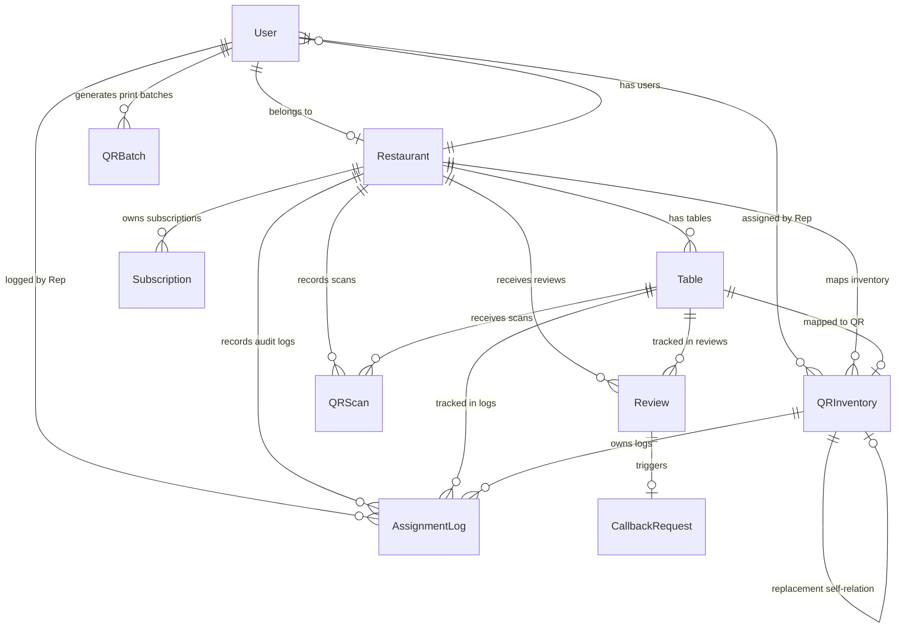

# ReviewFlow: Full Product Walkthrough & Deployment Guide

Welcome to the comprehensive walkthrough of **ReviewFlow**, a premium, multi-tenant B2B SaaS customer feedback platform designed for restaurants. 

This document provides an executive summary of the product goal, a feature breakdown of all 5 modules, database schemas, a full API endpoint catalog, environment variables configuration, and hosting/deployment steps.

---

## 📂 1. Executive Product Overview & Goals

ReviewFlow is built to replace traditional, low-conversion paper feedback forms and generic survey platforms (e.g., Google Forms) with a premium dining table experience. The platform helps restaurants:
1. **Collect customer feedback** directly at tables with a mobile-first, friction-free portal.
2. **Direct positive sentiment** (4-5 star reviews) to the restaurant's public Google Reviews page.
3. **Recover unsatisfied customers privately** (1-3 star reviews) by offering immediate, direct callback requests to the management team.
4. **Deprecate legacy print-on-demand table QRs** in favor of pre-printed, inventory-tracked QR sticker sheets distributed by field representatives.
5. **Monitor restaurant health metrics** through an executive-level intelligence dashboard.
6. **Enforce Subscription Status Controls** (Active, Suspended, Expired) to restrict dashboard and review collection capabilities.

---

## 👥 2. User Roles & Access Control (RBAC)

ReviewFlow enforces strict role-based access control (RBAC) and portal isolation. All portals have been migrated to a secure, unique username-based operational model:

| Portal Path | Target Roles | Login Rules & Username Formats |
| :--- | :--- | :--- |
| **`/login` (Standard)** | `OWNER`, `MANAGER` | Dedicated Restaurant Portal. Only allows `OWNER` (`[slug]-owner`) and `MANAGER` (`[slug]-manager`) roles. Super Admin login attempts are rejected with *"Please use the administrator portal."*. Rep login attempts are rejected with *"Please use the field representative portal."*. |
| **`/superadmin`** | `SUPER_ADMIN` | System administrator dashboard login. Uses `deco-admin` username. Accessible via direct URL or the hidden lock icon. |
| **`/reps`** | `REP` | Field representative inventory portal. Uses unique name-based usernames (e.g. `dan`, `rahul`, `karthik`). |

### Access & Redirect Middleware Rules:
* **Registration Blocked**: The public registration route `/register` is blocked at the middleware level and redirects to `/`. Self-registration is disabled for production.
* **Suspension Filter**: If a logged-in user's restaurant is `SUSPENDED`, edge middleware clears their session cookie and redirects them to `/login?error=suspended` (displaying *"Your account has been suspended. Please contact support."*).

---

## 🛠️ 3. Module-by-Module Feature Walkthrough

### 🔒 Modules 1 & 2: Multi-Tenant Core & Authentication
* **Tenant Isolation**: All REST endpoints check session tokens to filter data. A Restaurant Owner/Manager is strictly isolated to their own `restaurantId` data.
* **Suspended Restaurant State**:
  * Owners and Managers are blocked from logging in.
  * Attempting to scan a QR code for a suspended restaurant displays: *"This review portal is temporarily unavailable."*
  * Historical data is kept completely intact.
* **Expired Restaurant State**:
  * Owner login is allowed, and dashboards are visible.
  * A prominent, non-dismissible warning banner is displayed at the top of the dashboard: *"Your subscription has expired. Please upgrade or renew your subscription to reactivate review collections at your tables."*
  * Scanning a table QR code displays: *"This review portal has expired."* feedback collections are disabled.

### 📱 Module 3: Customer Review Portal (`/r/[qrCode]`)
* **Apple & Linear Inspired UI**: Minimalist aesthetics, Outfit typography, smooth animations, and touch-friendly layouts.
* **Smart Feedback Redirection**:
  * **Happy Customers (Rating 4-5)**: Prompts a Google Review CTA card that links directly to the restaurant's Google Place review URL.
  * **Unhappy Customers (Rating 1-3)**: Skips the Google link and opens a private callback form requesting the customer's name and phone number.
* **Deduplication Check**: Prevents spam by checking the client's User-Agent and blocking repeated QR scans on the same table within 5 minutes.

### 📊 Module 4: Restaurant Intelligence Dashboard (`/dashboard/restaurant`)
* **Executive Metrics**: Overall Health Score (0-100), conversion rate (scans vs. reviews), redirect rate (Google CTR), and negative feedback recovery rate.
* **SVG Sparkline Charts**: Custom-drawn charts mapping QR scan trends and review volume over 7-day, 30-day, or custom date ranges.
* **Performance Matrices**: Highlight most/least scanned tables, best/worst sections, and lowest rated dining categories (Food, Service, Ambience).
* **Callback Manager**: Live tracker showing Pending, Contacted, and Resolved status with direct recovery triggers.

### 🏷️ Module 5: QR Inventory & Rep Assignment Portal (`/dashboard/rep`)
* **Centralized QR Inventory**: Disables legacy print-at-home table QR sheets. Super Admins generate sequential QR codes in bulk and export them in standardized grid sheets.
* **Standardized Print Exporter**:
  * **Layout**: A4 Page Format, Portrait orientation.
  * **Grid**: 5 columns x 8 rows (40 stickers per page).
  * **Design**: High-contrast, plain black-on-white QR codes with the tiny serial number (e.g. `QR-000001`) printed below each QR code.
  * **Guidelines**: Outlined by thin, dotted guidelines for easy cutting.
  * **No branding**: Completely stripped of brand cards, Vercel widgets, instruction headers, or footers.
* **Audit Batch Registry**: The `QRBatch` database model functions as an audit/print registry (containing `batchName`, `startSerial`, `endSerial`, `quantity`, `generatedBy`, `generatedAt`). There are no foreign key mappings between `QRInventory` and `QRBatch` to keep database schema logic simple and performant.
* **Representative Assign Portal**:
  1. Rep scans/inputs a pre-printed QR code.
  2. Rep autocomplete-searches the target restaurant and inputs table/section coordinates.
  3. Displays an **Assignment Preview Overlay** showing QR code, restaurant name, section, and table number for confirmation.
* **Damaged QR Swap**: Reps swap damaged codes with an unassigned one, transferring history and updating records in a single click.
* **Inactive Status**: Reps toggle status between `ASSIGNED` and `INACTIVE` to pause sticker access.

### 🏢 Super Admin Restaurant Onboarding (`/dashboard/super-admin/create-restaurant`)
* **Creation Workflow**: A dedicated tenant creation portal where admins input:
  * Restaurant Name
  * Owner Name
  * Owner Email (Optional)
  * Owner Password
  * Phone Number & Address
  * Subscription Plan (`FREE`, `PRO`, `ENTERPRISE`)
* **Automatic Provisioning**: On submission, the system runs a database transaction to create the restaurant, set up the subscription, and automatically provision both the `OWNER` (`[slug]-owner` using the provided password) and default `MANAGER` (`[slug]-manager` using a secure, randomly generated password) user accounts. Logs the onboarding activity.
* **Success Presentation**: Returns an onboarding success card presenting the automatically generated usernames and passwords for both the Owner and Manager accounts.

---

## 🗄️ 4. Detailed Database Schema (`prisma/schema.prisma`)



### Prisma Schema Definitions
1. **`User`**: Tracks authentication, role (`SUPER_ADMIN`, `OWNER`, `MANAGER`, `REP`), and restaurant membership.
2. **`Restaurant`**: Stores business profile, slug, phone, address, status (`ACTIVE`, `SUSPENDED`, `EXPIRED`), and redirection preferences.
3. **`Table`**: Stores table number, section, status (`ACTIVE`/`INACTIVE`/`ARCHIVED`), and current active unique `qrCode`.
4. **`Review`**: Records ratings (Food, Service, Ambience, Overall), comments, callback requested status, and Google CTR logs.
5. **`CallbackRequest`**: Holds customer recovery information (status: `PENDING`, `CONTACTED`, `RESOLVED`).
6. **`QRScan`**: Tracks raw scans with date and user-agent string for analytics deduplication.
7. **`QRInventory`**: Tracks individual pre-printed stickers and status (`UNASSIGNED`, `ASSIGNED`, `DAMAGED`, `REPLACED`, `INACTIVE`).
8. **`AssignmentLog`**: The immutable audit log of assignment activities.
9. **`QRBatch`**: Tracks print batch registries (start serial, end serial, quantity) for printing sheets.

---

## 📡 5. Full API Endpoint Reference

All endpoints return JSON and require a valid HTTP session cookie or Authorization header.

### 🔑 Authentication APIs
* **`POST /api/auth/login`**: Authenticates credentials using `username` and `password` directly. Verifies portal-role restrictions and sets a JWT session cookie.
* **`POST /api/auth/logout`**: Clears the JWT session cookie.
* **`GET /api/auth/me`**: Returns current session user, role, and restaurant status.
* **`POST /api/auth/forgot-password`**: Generates reset tokens and prints link to the server console.
* **`POST /api/auth/reset-password`**: Verifies reset token and updates password.

### 🍴 Restaurant & Owner APIs
* **`GET /api/restaurant/details`**: Returns profile of the current tenant restaurant.
* **`POST /api/restaurant/details`**: Updates phone, address, and toggles for Google review redirections.
* **`GET /api/restaurant/reviews`**: Returns list of all reviews. Supports filters: `rating` (1-5), `startDate`, `endDate`, and text `search`.
* **`GET /api/restaurant/callbacks`**: Returns negative reviews requesting callback. Filter by status: `PENDING`, `CONTACTED`, `RESOLVED`.
* **`POST /api/restaurant/callbacks`**: Updates status of a callback recovery request.
* **`GET /api/restaurant/analytics`**: Returns metric cards, SVG sparklines, section analytics, and table lists. Filters: `range`, `startDate`, `endDate`.
* **`GET /api/restaurant/activities`**: Returns audit trail of actions taken in the restaurant tenant.

### 📱 Customer Dining Portal APIs
* **`GET /api/r/[qrCode]`**: Resolves the QR code. Returns restaurant and table details if the QR is assigned and active. Deduplicates the scan and logs a `QRScan` record. Returns `403` if the restaurant is `SUSPENDED` or `EXPIRED`.
* **`POST /api/r/[qrCode]`**: Submits a customer review (Food, Service, Ambience, comment) and saves it to the database. Blocked if the restaurant status is not `ACTIVE`.
* **`POST /api/r/callback`**: Submits customer contact details (Name, Phone) to trigger a manager callback.
* **`POST /api/r/cta`**: Tracks customer interaction with the Google Review CTA button (views and clicks).

### 🏷️ Representative Onboarding APIs
* **`POST /api/rep/assign`**: Processes all rep-level QR adjustments. Body parameter `action` determines the operations:
  * `VALIDATE`: Checks if a scanned code exists and returns its details.
  * `ASSIGN`: Maps an unassigned code to a restaurant section and table.
  * `REASSIGN`: Moves an active code to a different table.
  * `REPLACE`: Swaps a damaged code with an unassigned one, transferring history.
  * `TOGGLE_INACTIVE`: Toggles status between `ASSIGNED` and `INACTIVE` to pause sticker access.
* **`GET /api/rep/history`**: Returns the `AssignmentLog` list for the logged-in representative.

### ⚙️ Super Admin APIs
* **`GET /api/super-admin/stats`**: Returns platform-wide aggregates (total restaurants, total users, overall scans).
* **`GET /api/super-admin/restaurants`**: Returns all restaurants (including soft-deleted ones) and subscription statuses.
* **`POST /api/super-admin/restaurants`**: Onboards new restaurant tenants, creating the owner account and subscription plan.
* **`PUT /api/super-admin/restaurants`**: Restores soft-deleted restaurants or updates restaurant status (`ACTIVE`, `SUSPENDED`, `EXPIRED`), triggering activity log entries.
* **`DELETE /api/super-admin/restaurants`**: Soft-deletes a restaurant tenant.
* **`GET /api/super-admin/users`**: Returns all system users and roles.
* **`GET /api/super-admin/inventory`**: Returns QR inventory stats, current inventory list, and print batches list. Supports status, search, and `batchId` filtering.
* **`POST /api/super-admin/inventory`**: Bulk generates a specified quantity of unassigned pre-printed QR codes and records the print batch.

---

## ⚙️ 6. Environment Configuration (`.env`)

Add the following environment variables to your host environment or root `.env` file:

```env
# 1. PostgreSQL Database URL (Transaction pool connection for Prisma client)
DATABASE_URL="postgresql://[username]:[password]@[db-host]:5432/[db-name]?schema=public"

# 2. PostgreSQL Direct URL (Direct connection string for running migrations)
DIRECT_URL="postgresql://[username]:[password]@[db-host]:5432/[db-name]?schema=public"

# 3. Next.js JWT Authentication Secret Key
JWT_SECRET="generate-a-secure-random-hash-for-production-usage"

# 4. Optional: Host URL (For constructing callback redirects)
NEXT_PUBLIC_APP_URL="https://reviewflow.yourdomain.com"
```

---

## 🚀 7. Deployment & Hosting Guide

Follow these steps to deploy ReviewFlow on a cloud server or hosting platform.

### Step 1: Clone & Install Dependencies
```bash
git clone https://github.com/your-repo/reviewflow.git
cd reviewflow
npm install
```

### Step 2: Provision a PostgreSQL Database
Provision a PostgreSQL instance on platforms like **Supabase**, **Neon**, **Render**, or **AWS RDS**. Enable external connections and copy your connection string credentials.

### Step 3: Run Database Migrations
Generate the Prisma client types and apply the database schema to your live SQL database:
```bash
npx prisma generate
npx prisma migrate dev --name init
```

### Step 4: Run the Seeding Script
Populate your database with the initial platform seeding (Super Admin, Representative, Test Restaurants, and pre-printed stickers):
```bash
npx prisma db seed
```

### Step 5: Hosting Deployments

#### Option A: Deploy to Vercel (Recommended)
ReviewFlow is built on the Next.js pages router, making it fully optimized for Vercel:
1. Push your code to GitHub/GitLab.
2. Link your repository in Vercel.
3. Configure the environment variables (`DATABASE_URL`, `DIRECT_URL`, `JWT_SECRET`) in the Vercel Project Settings.
4. Set the **Build Command** to `npm run build` and **Output Directory** to `.next`.
5. Click **Deploy**.

#### Option B: Deploy on a Linux VPS (Ubuntu / Debian)
If hosting on a virtual private server (e.g. DigitalOcean, Linode, AWS EC2):
1. Install Node.js (v18+) and PM2 (Process Manager).
2. Configure `.env` in the root project folder.
3. Build the application:
   ```bash
   npm run build
   ```
4. Start the server daemon with PM2:
   ```bash
   pm2 start npm --name "reviewflow" -- run start
   ```
5. Configure Nginx as a reverse proxy forwarding port `80`/`443` to `http://localhost:3000`. Set up an SSL certificate using Let's Encrypt Certbot.

---

## 🧪 8. Post-Deployment Verification Playbook

Once deployed, use the preconfigured seed credentials to verify each module:

1. **Verify Customer Dining Flow**:
   * Navigate to `/r/TBLR1GF1` (Table 1, Bella Italia).
   * Submit a 5-star rating; confirm it shows the **Google Review CTA button**.
   * Submit a 2-star rating; confirm it opens the **private manager callback form**.
2. **Verify Manager Callback Flow**:
   * Log in to `/login` using manager details (`bella-italia-manager` / `manager123`).
   * Go to **Callbacks** dashboard and verify that the negative feedback from Table 1 appears in the queue. Update its status to "Resolved".
3. **Verify Representative Portal**:
   * Log in to `/reps` using representative details (`dan` / `rep123`) or new reps (`rahul` / `rep123` or `karthik` / `rep123`).
   * Navigate to `/dashboard/rep/assign`.
   * Input sticker code `QR-000005`, select "Burger Joint" and assign to Table "9". Check the preview overlay modal and click "Confirm".
   * Navigate to `/r/QR-000005` to verify it resolves correctly.
4. **Verify Super Admin Tools**:
   * Log in to `/superadmin` using admin details (`deco-admin` / `admin123`).
   * Navigate to `/dashboard/super-admin/create-restaurant` to onboard a new restaurant. Verify that the success card displays usernames and passwords for both Owner and Manager accounts.
   * Go to `/dashboard/super-admin/qr-inventory`. Click **Generate Batch** to append 250 new stickers.
   * Click **Download printable sheets** to verify that a print-ready A4 PDF containing sequential QR stickers aligned in a 5x8 grid is generated.
   * Go to `/dashboard/super-admin/restaurants/[id]`. Toggle status to **Suspend Restaurant** and verify that logging in as that owner is blocked and table scans return *"This review portal is temporarily unavailable."*
